# Blueprint 

Blueprint is a clinical Session management web application designed to support psychologists and clinical teams in managing patients, sessions, and treatment workflows in a structured and efficient way.

Built in collaboration with a clinical psychologist at a private mental health hospital, Blueprint has evolved through three rounds of real stakeholder testing and feedback from a ward-based management dashboard (v1.0) to a session-focused clinical workflow tool (v1.4).

**Live Demo:** https://blueprintcaretech.com

---

## Overview

Blueprint was developed to simplify day-to-day clinical operations, including:

- Patient tracking across wards
- Session scheduling and management
- Individual and group therapy session tracking
- CORE-10 outcome monitoring
- Clinical note organisation
- Activity tracking for audit and accountability

The system focuses heavily on usability, ensuring clinicians can navigate quickly and efficiently in real-world clinical environments with minimal clicks.

---

## Key Features

### Dashboard
- Overview of active patients and today's sessions
- Ward-based patient summaries (Hope, Lakeside, Manor)
- Quick action shortcuts for faster workflows
- Ward-coloured session cards for instant visual identification
- Activity log with full audit trail

### Calendar System
- View all sessions across the month
- Add individual or group sessions directly from the calendar
- Click any day to view all sessions for that date
- Click sessions to open full details instantly
- Supports both individual and group session visibility
- Ward-coloured chips for quick identification

### Patient Management
- Admit patients with ward and room allocation
- Edit patient details and room changes
- Discharge patients with backdated discharge date support
- View full patient session history
- Discharged patient management
- Archived session retrieval

### CORE-10 Tracking
- Record CORE-10 completion on admission
- Record CORE-10 completion on discharge
- Editable admission and discharge CORE-10 status
- Visual completion indicators (Completed / Pending)

*Added based on direct clinician workflow feedback.*

### Individual Session Management
Create and manage one-to-one clinical sessions with:
- CareNotes tracking
- Tracker completion
- Task tracking
- Session notes
- Archive and delete sessions

### Group Session Management *(introduced in v1.4)*
- Create group therapy sessions across one or multiple wards
- Dynamic patient attendance register loaded by ward
- Mark attendance live (Attended / Declined / DNA)
- Record per-patient attendance notes
- View historical group sessions with full attendance details
- Delete group sessions with activity log entry
- Full calendar integration for group sessions

*Built based on direct psychologist feedback from real clinical workflows.*

### Ward Filtering
Filter patients and sessions by ward across:
- Dashboard today's sessions
- Calendar
- Patient selection dropdown
- Group session attendance register

### Clinical Notes
- Admission notes
- Discharge notes
- Structured note viewing
- Improved readability for long notes

### Activity Log
Tracks all staff actions including:
- Session creation, updates, archiving and deletion
- Patient admissions, room changes and discharges
- Group session creation and deletion
- Ward badge display for quick identification

*Supports clinical accountability and CQC audit requirements.*

---

## Tech Stack

| Layer | Technology |
|---|---|
| Backend | PHP (Custom MVC Architecture) |
| Frontend | HTML, CSS, Vanilla JavaScript |
| Styling | Bootstrap Icons, Custom CSS |
| Database | MySQL |
| Auth | Session-based authentication with CSRF protection |
| Environment | PHP dotenv (vlucas/phpdotenv) |
| Version Control | Git & GitHub |
| Hosting | Hostinger |

---

## ⚠️ Usage Notice

```bash

This repository is made public for portfolio and demonstration purposes only.  
Cloning, forking, copying, or redistributing any part of this code without explicit 
written permission from the developer is not permitted.

© 2026 Stanley Erhabor. All rights reserved.
```

---

## Security
- CSRF protection on all forms
- Session-based authentication
- Secure password hashing
- Environment variables for all credentials (never committed to version control)

---

## Version History

### v1.4 *(Current)*
- Added full group session workflow with attendance register
- Added group session history and detail views
- Added group session deletion with activity logging
- Added group sessions to calendar widget
- Added editable discharge CORE-10
- Added backdated discharge date support
- Improved patient modal with Add Session button
- Ward colour consistency throughout the entire app
- Mobile responsive improvements
- Multiple UI/UX improvements based on stakeholder feedback
- Bug fixes from third round of stakeholder testing

#### v1.4 Screenshots


### v1.2
- Introduced calendar system
- Added session creation via calendar
- Added ward filtering across dashboard and patient selection
- Enabled CORE-10 editing after admission
- Improved UI/UX based on clinician feedback

#### v1.2 Screenshots

**Homepage Overview**
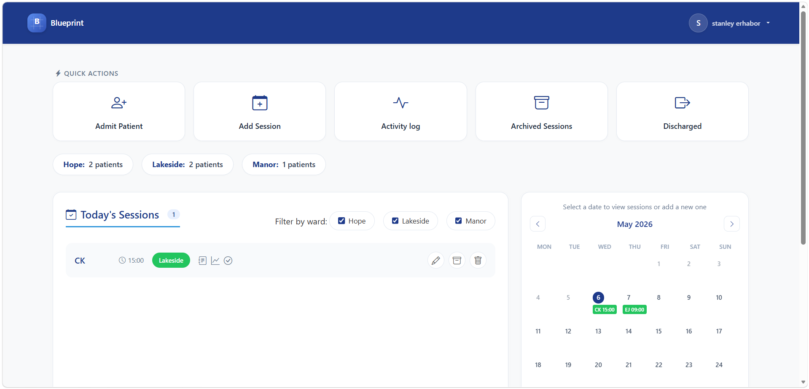

**Homepage Overview**
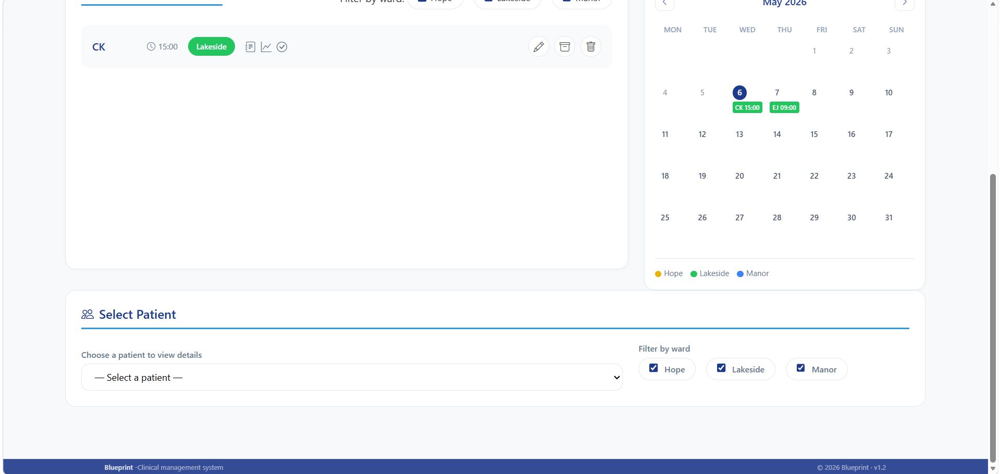

**Homepage Overview**
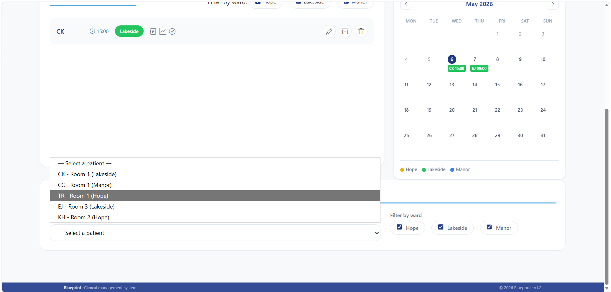

**Admit Patient Modal**
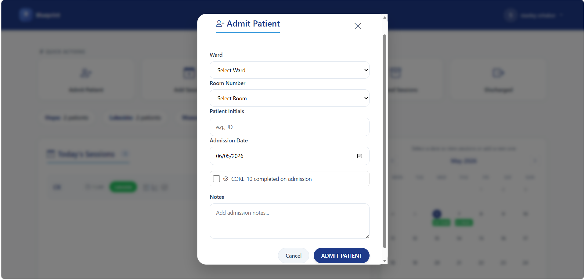

**Add session, dynamic round 3 wards and room drop down**
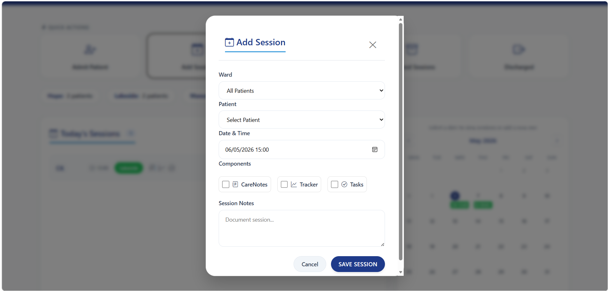

**Calender session view**
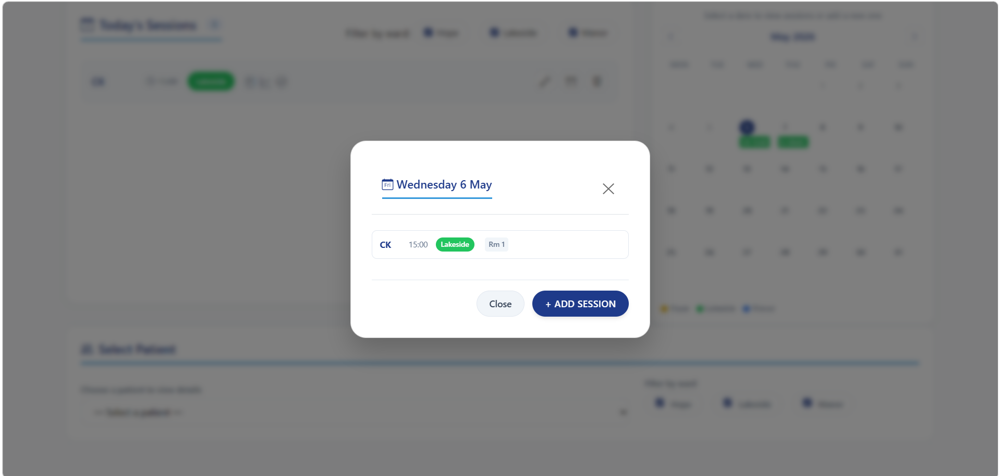

**Activity Logs with audit trail**
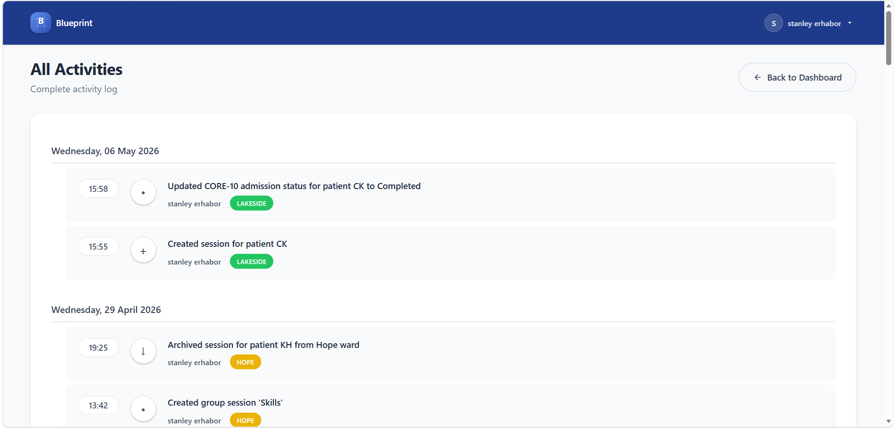

**Patient Modal**
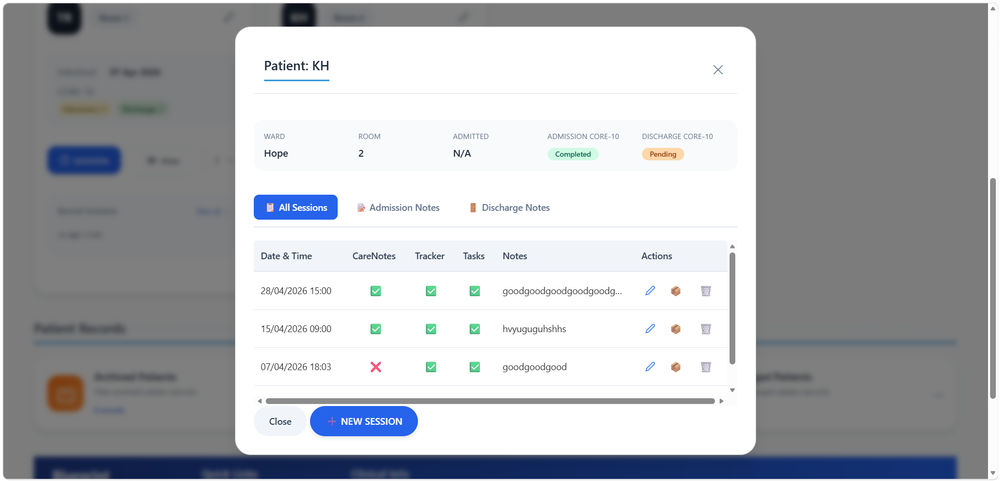

**Patient Card Selection**
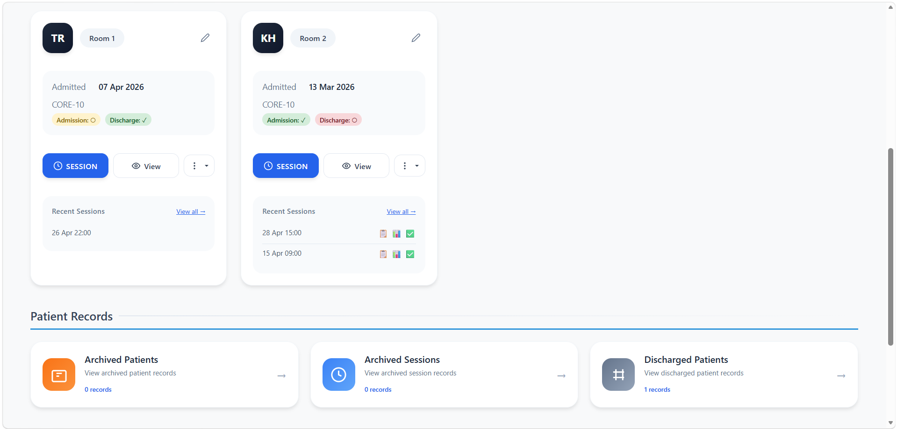

**Archived Sessions**
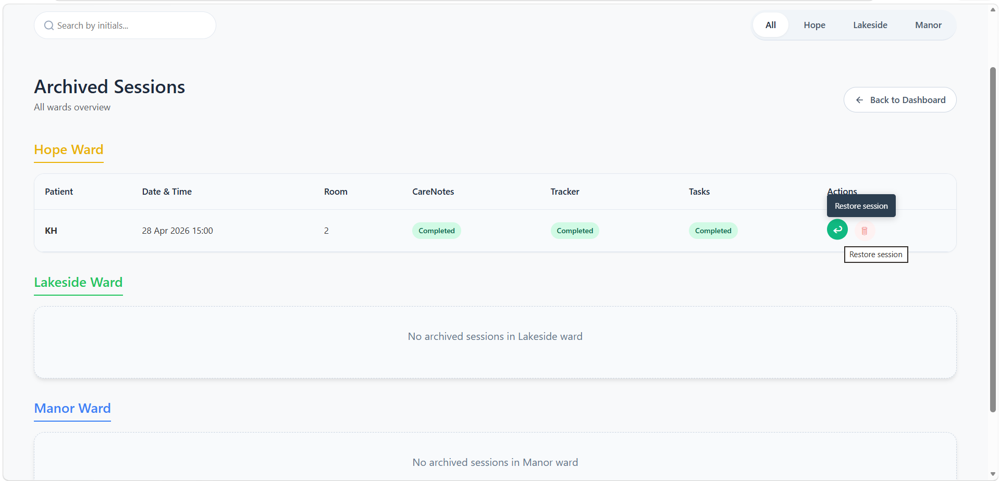

**Discharged Patient list**
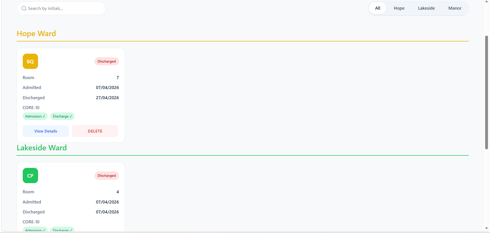

**Discharged Patient modal**
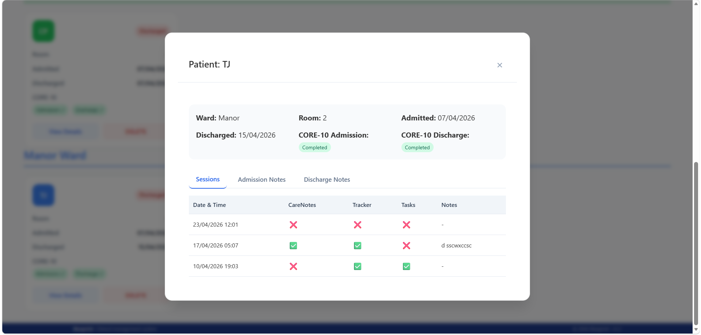


### v1.0
- Initial patient and individual session management system
- Ward-based dashboard with bed counts and CORE-10 stats
- Individual session tracking per ward

#### v1.0 Screenshots

**Homepage Overview**
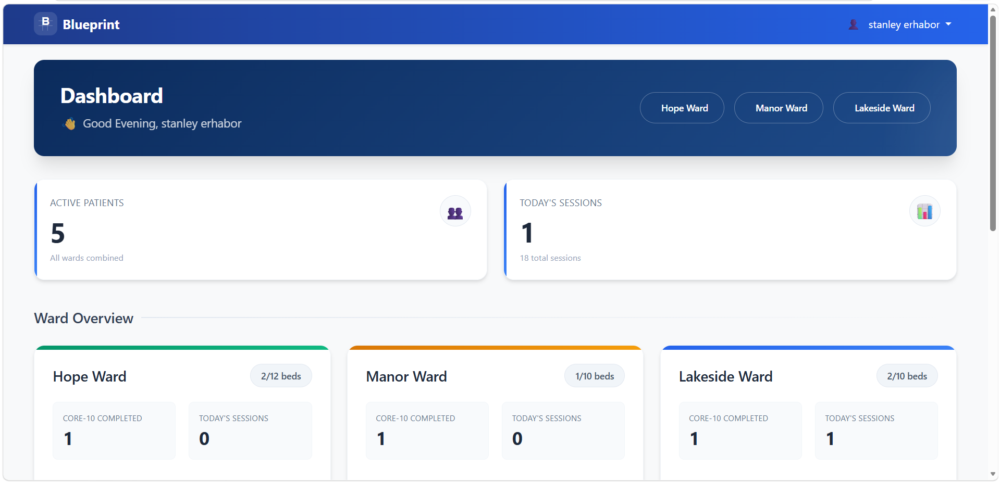

**Activity Tracking**
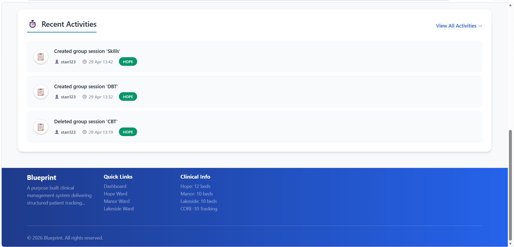

**Ward-Based Navigation**
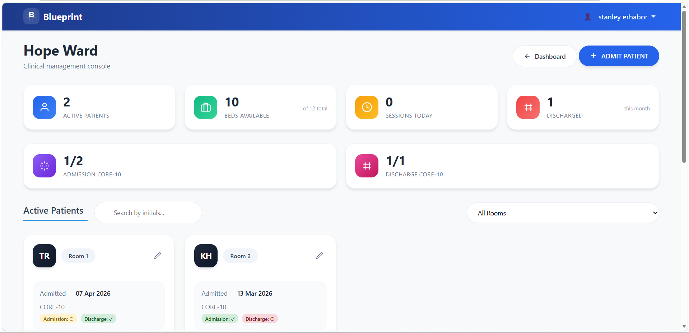

**Admit Patient Modal**
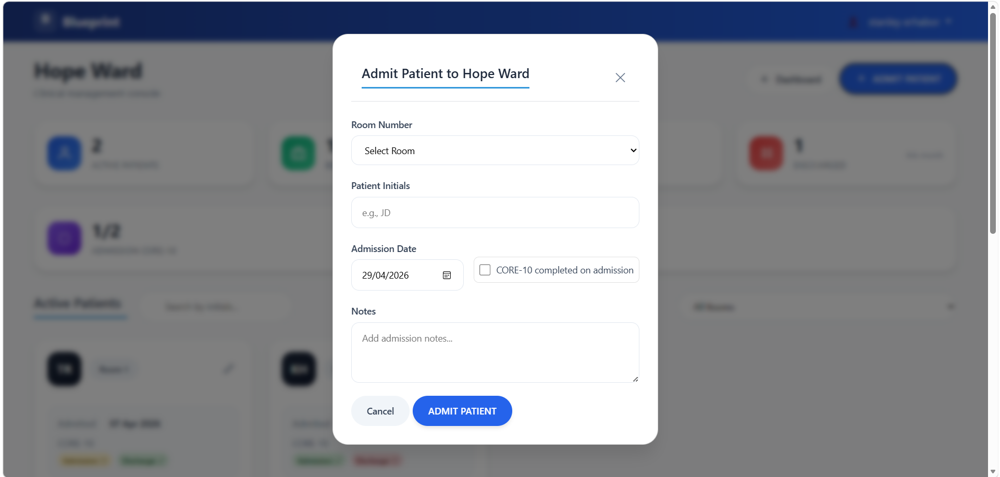

**Patient Modal**


**Patient Card Selection**


**Archived Sessions**
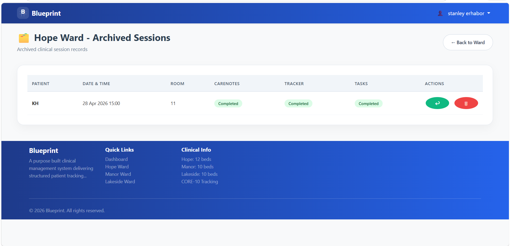

**Discharged Patients**
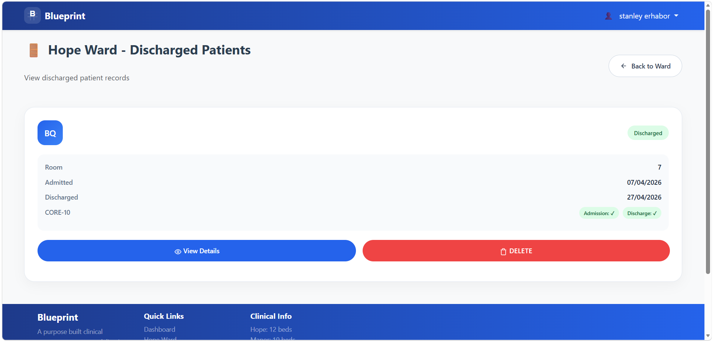

---

## Project Purpose

Blueprint was developed in close collaboration with a clinical psychologist to:

- Improve workflow efficiency in a private mental health hospital setting
- Reduce friction in session tracking and documentation
- Provide clearer visibility of patient activity across wards
- Support clinical decision-making and governance requirements
- Replace paper-based processes with a structured digital workflow

Blueprint continues to evolve through real stakeholder feedback and iterative testing.

---

## Future Improvements
- Role-based access control (admin, psychologist, nurse)
- Reporting and analytics dashboard
- CORE-10 score entry (not just completion status)
- Multi-hospital support
- Export session reports to PDF

---

## Developer

**Stanley Erhabor**  
Full Stack Developer  
[GitHub](https://github.com/stanerab)

---

## License

This project is currently for educational, portfolio, and clinical prototype use.
